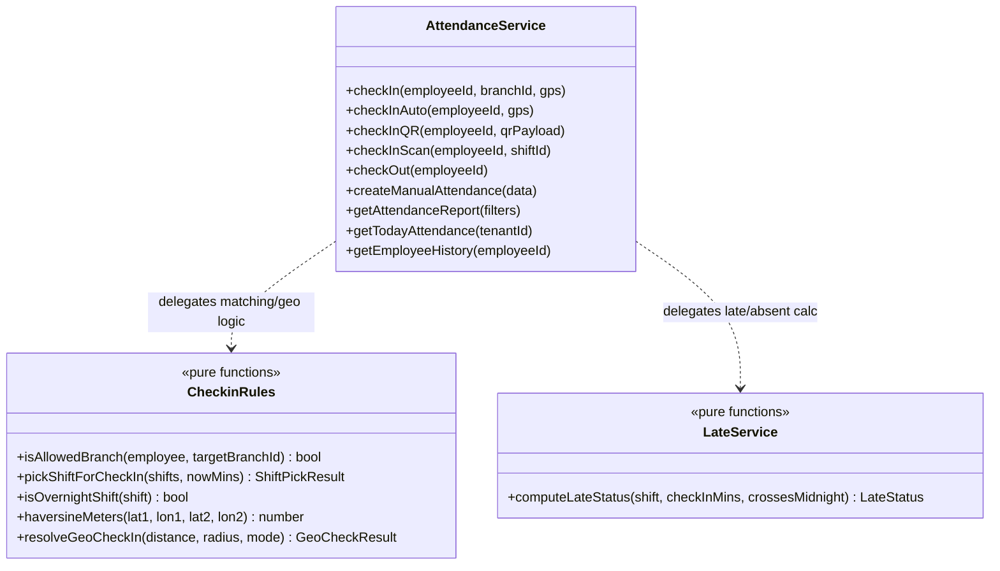
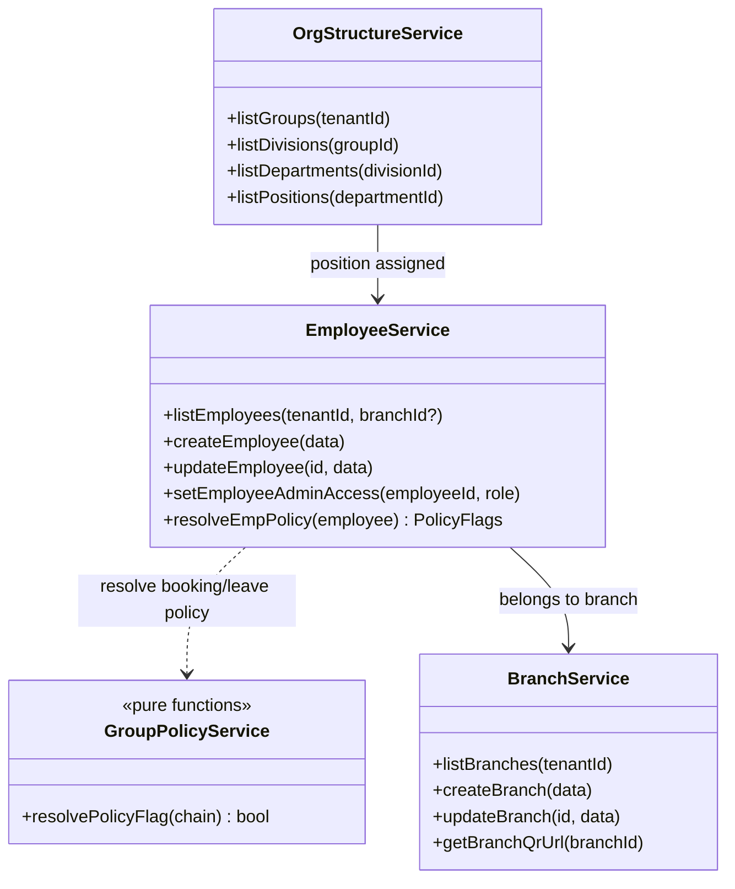
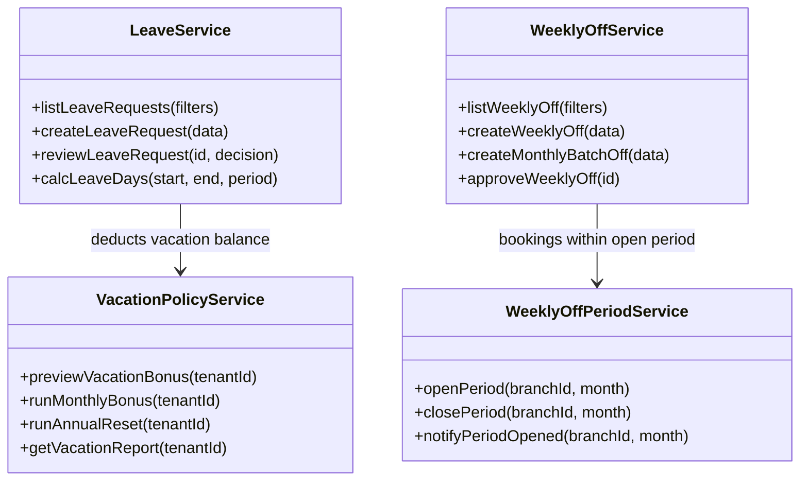
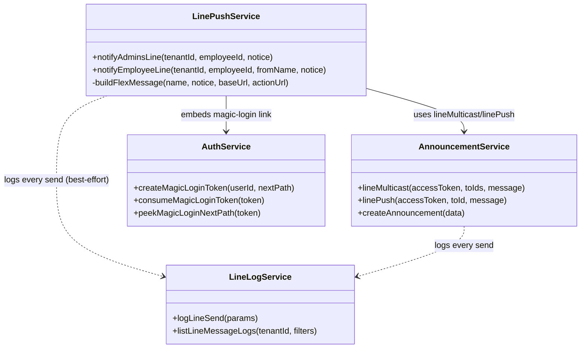
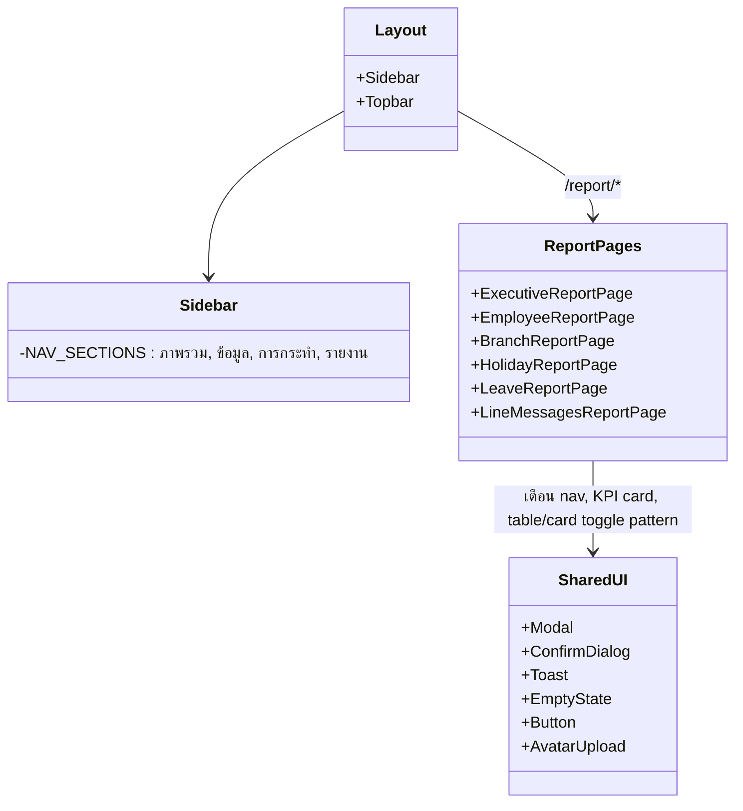

# Class Diagram

Backend เขียนด้วย Fastify + TypeScript แบบ **modular monolith** — ไม่ได้ออกแบบเป็น OOP class ทั่วทั้งระบบ แต่แต่ละโมดูลใน `server/src/modules/<name>/` ประกอบด้วย 3 ไฟล์ที่ทำหน้าที่คล้าย class ที่แยกความรับผิดชอบ:

- **`*.route.ts`** — ชั้นรับ HTTP request, ตรวจสิทธิ์ (RBAC), เรียก service
- **`*.service.ts`** — ตรรกะทางธุรกิจ (business logic) + เข้าถึงฐานข้อมูลผ่าน Prisma
- **`*.schema.ts`** (บางโมดูล) — Zod schema สำหรับ validate input

แผนภาพด้านล่างนำเสนอโมดูลหลักในรูปแบบ class diagram (แทน service module ด้วย class, เมธอดคือฟังก์ชันที่ export)

## 1. โมดูลหลักด้าน Attendance (เช็คชื่อ)

> `CheckinRules` และ `LateService` ถูกแยกเป็น pure function ล้วน (ไม่พึ่ง Prisma) เพื่อให้ unit test ได้โดยไม่ต้อง mock database — ดู [Test_Cases.md](Test_Cases.md)

## 2. โมดูลด้านองค์กรและพนักงาน

## 3. โมดูลด้านวันลา/วันหยุด

## 4. โมดูลด้านแจ้งเตือน

## 5. Frontend — โครงสร้างหน้าเว็บแอดมิน (React)

## เอกสารที่เกี่ยวข้อง

[API_Documentation.md](API_Documentation.md) แสดง endpoint ที่แต่ละ service เปิดให้เรียกใช้ · [ER_Diagram.md](ER_Diagram.md) แสดงโครงสร้างข้อมูลที่แต่ละ service เข้าถึง
