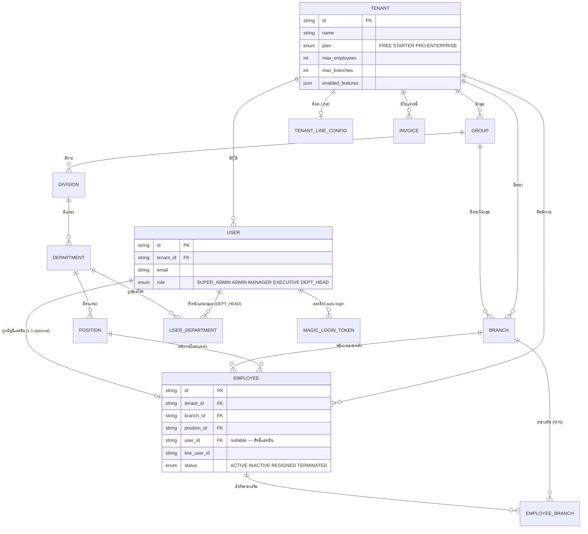
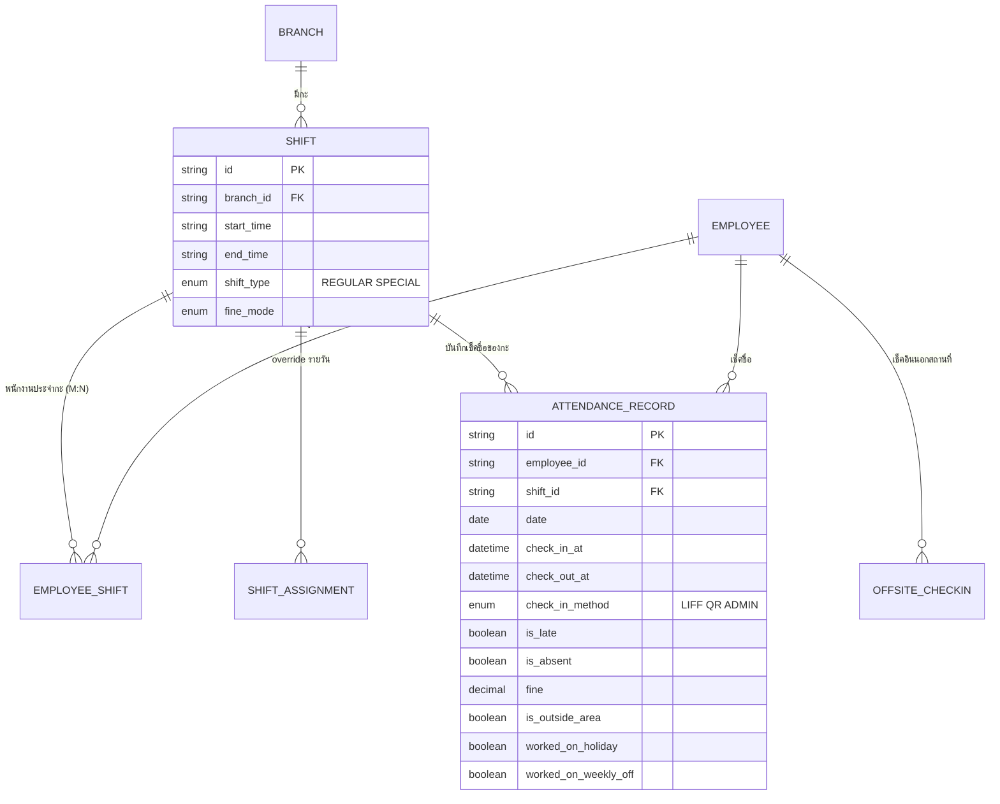
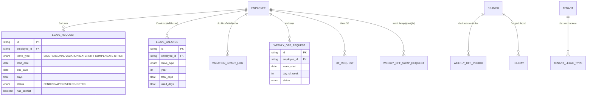
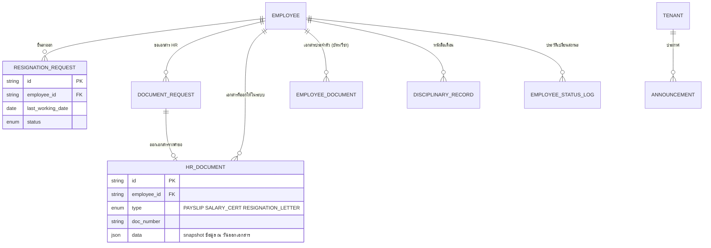
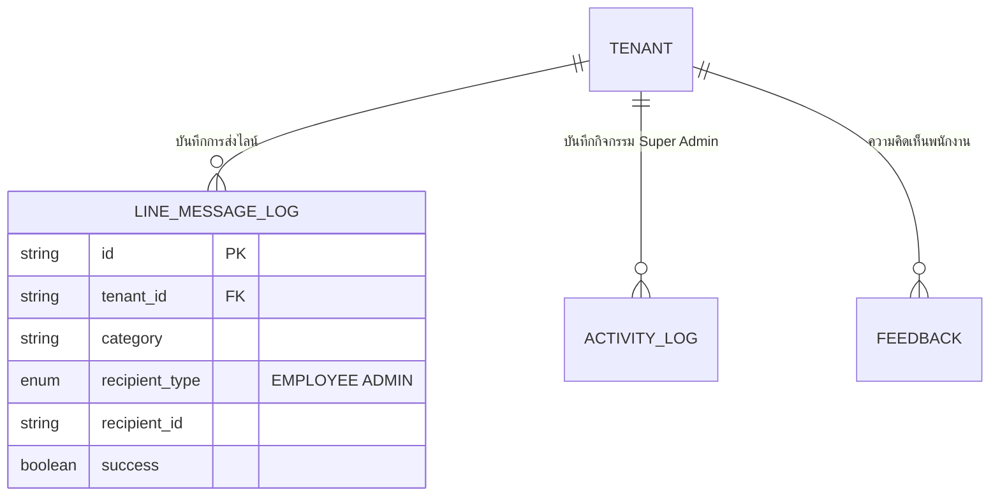

# Entity Relationship Diagram

แหล่งที่มาของความจริง (source of truth) คือ `server/src/prisma/schema.prisma` — เอกสารนี้สรุปเฉพาะ entity และความสัมพันธ์หลักที่สำคัญต่อความเข้าใจระบบ แบ่งเป็นกลุ่มย่อยเพื่อให้อ่านง่าย ดูรายละเอียดฟิลด์ครบทุกตารางที่ [Data_Dictionary.md](Data_Dictionary.md)

## 1. Tenant, ผังองค์กร และผู้ใช้งาน

## 2. กะการทำงาน และการเช็คชื่อ

## 3. วันลา วันหยุด และ OT

## 4. วงจรชีวิตพนักงาน เอกสาร และประกาศ

## 5. การแจ้งเตือนและ Log

## หมายเหตุการออกแบบที่สำคัญ

- ทุก entity หลักมี `tenant_id` เป็น foreign key ไปยัง `Tenant` เพื่อแยกข้อมูลระหว่างบริษัทลูกค้า (multi-tenant isolation)
- `Employee.user_id` เป็นความสัมพันธ์ 1:1 (optional) ที่เชื่อมพนักงานเข้ากับบัญชีแอดมิน — ใช้ตอนพนักงานคนหนึ่งมีสิทธิ์เป็นแอดมินด้วย (เช่น หัวหน้าสาขา) ทำให้สลับเข้าเว็บแอดมินจาก LIFF ได้
- นโยบาย (booking/leave enabled, โควต้า) resolve แบบ cascade ผ่านฟังก์ชัน `resolvePolicyFlag()` ไล่จาก Employee override → Position → Department → Division → Branch → Group
- `HrDocument.data` เก็บเป็น JSON snapshot ของข้อมูลพนักงาน/บริษัท ณ เวลาที่ออกเอกสาร โดยตั้งใจไม่ join ข้อมูลสดตอนแสดงผลย้อนหลัง เพื่อให้เอกสารเก่าคงข้อมูลเดิมแม้พนักงานย้ายสาขา/เปลี่ยนตำแหน่งภายหลัง
