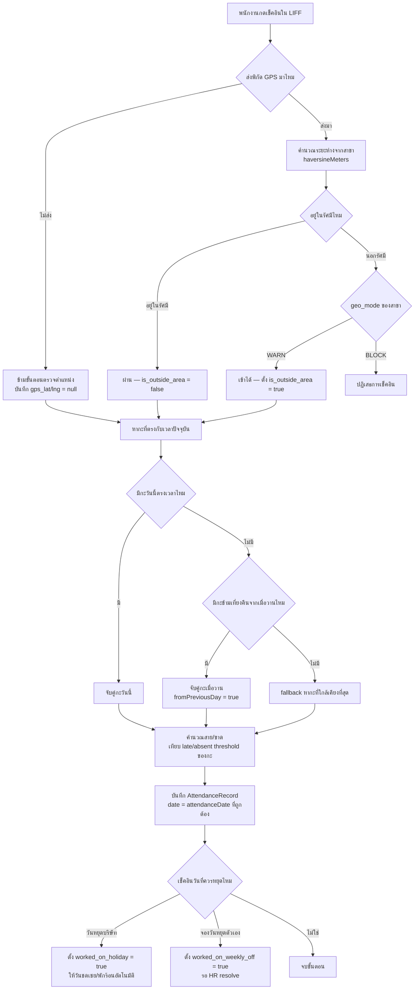
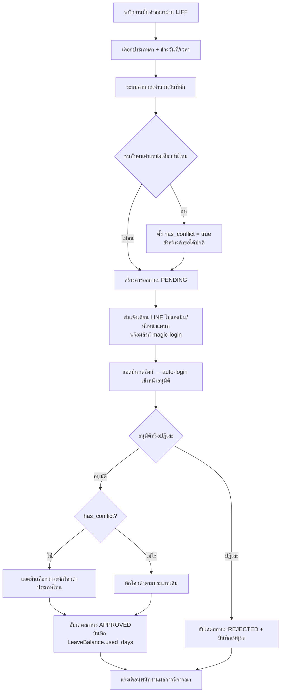
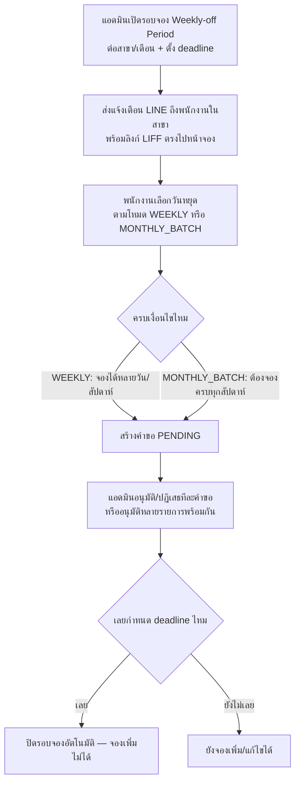
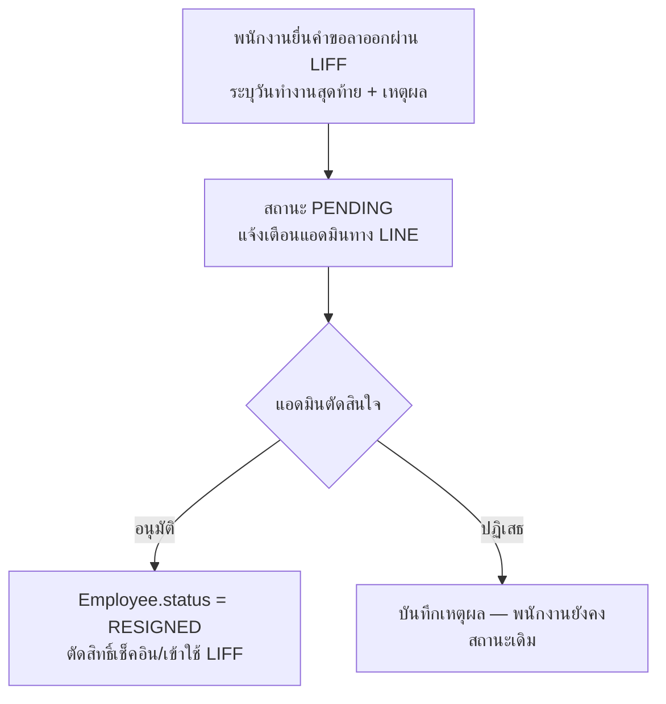

# Flowchart

แผนภาพลำดับการทำงาน (flow) ของกระบวนการหลักในระบบ อ้างอิงพฤติกรรมจริงของโค้ด

## 1. การเช็คอินของพนักงาน (Auto-detect Shift + Geo-fencing)



## 2. การขอลาและอนุมัติ



## 3. การจองวันหยุดประจำสัปดาห์/เดือน



## 4. คำขอลาออก



## 5. Magic Login (Auto-login จากลิงก์แจ้งเตือน LINE)

```mermaid
flowchart TD
    A[ระบบสร้างเหตุการณ์ที่ต้องแจ้งเตือนแอดมิน] --> B[ออก MagicLoginToken<br/>ผูก user_id + next_path, อายุ 2 นาที]
    B --> C[ส่ง Flex Message ทาง LINE<br/>ปุ่มลิงก์ /magic-login?token=xxx]
    C --> D[แอดมินกดลิงก์]
    D --> E{token ยัง valid ไหม}
    E -- valid --> F[claim แบบ atomic — ใช้ได้ครั้งเดียว<br/>ออก access/refresh token จริง]
    F --> G[นำทางไปหน้า next_path ที่ตั้งใจ<br/>เช่น หน้าอนุมัติคำขอนั้นเลย]
    E -- ใช้ไปแล้ว/หมดอายุ --> H{เครื่องนี้มี session ที่ login อยู่แล้วไหม}
    H -- มี --> I[peek next_path จาก token เดิม<br/>พาไปหน้าเดิมโดยไม่ต้อง consume token]
    H -- ไม่มี --> J[แสดง "ลิงก์หมดอายุ" — ไปหน้า login ปกติ]
```

## 6. การขอเอกสาร HR

```mermaid
flowchart TD
    A[พนักงานขอเอกสารผ่าน LIFF<br/>สลิป/หนังสือรับรองเงินเดือน/หนังสือรับรองการทำงาน] --> B[สถานะ PENDING แจ้งเตือนแอดมิน]
    B --> C{แอดมินเลือกวิธีดำเนินการ}
    C -- สร้างในระบบ --> D[กรอกจำนวนเงิน/รายละเอียด<br/>ระบบดึงข้อมูลพนักงาน+บริษัทอัตโนมัติ]
    D --> E[ออกเลขที่เอกสาร + บันทึก snapshot<br/>พิมพ์/บันทึกเป็น PDF ผ่านเบราว์เซอร์]
    C -- อัปโหลดไฟล์แนบ --> F[แนบไฟล์ที่เตรียมไว้นอกระบบ]
    E --> G[กด "แนบไฟล์ + เสร็จ" ปิดคำขอ]
    F --> G
    G --> H[สถานะ COMPLETED แจ้งเตือนพนักงาน]
```

## เอกสารที่เกี่ยวข้อง

[SRS.md](SRS.md) อธิบายความต้องการของแต่ละ flow · [Class Diagram.md](Class%20Diagram.md) แสดง service ที่รับผิดชอบแต่ละขั้นตอน
