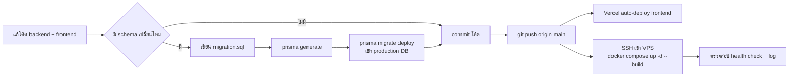

# Setup & Deployment Guide

เอกสารนี้อธิบายวิธี deploy ระบบขึ้น production ตาม workflow จริงที่ใช้อยู่ ดู [Development_Environment.md](Development_Environment.md) สำหรับการตั้งค่าพัฒนาบนเครื่อง local

## ภาพรวมสถาปัตยกรรม Production

| ส่วน | ที่โฮสต์ | วิธี deploy |
|---|---|---|
| **server** (API) | VPS (Docker) | SSH + `docker compose up -d --build` |
| **admin / superadmin / employee** (frontend) | Vercel | Auto-deploy เมื่อ push ขึ้น branch `main` |
| **ฐานข้อมูล** | MySQL (instance แยกต่างหาก) | Migration ผ่าน Prisma CLI จากเครื่อง dev |

## 1. Deploy Backend (server)

Backend รันเป็น Docker container บน VPS ควบคุมผ่าน SSH

```bash
# เชื่อมต่อ VPS แล้ว pull โค้ดล่าสุด + build ใหม่
ssh <server-alias>
cd /opt/timeline
git pull --ff-only
cd server
docker compose up -d --build
```

### ตรวจสอบว่า deploy สำเร็จ

```bash
# เช็คว่า image ใหม่จริง (เทียบเวลา build)
docker inspect --format='{{.Image}} {{.Created}}' server-backend-1
docker images server-backend --format '{{.ID}}\t{{.CreatedAt}}'

# เช็ค log ตอน start (ต้องเห็น cron ทั้ง 3 ตัวขึ้นครบ ไม่มี error)
docker logs --tail 30 server-backend-1

# เช็ค health endpoint ต้องได้ 200
curl -s -o /dev/null -w '%{http_code}\n' http://localhost:4002/health
```

## 2. การจัดการฐานข้อมูล (Database Migration)

ระบบ**ไม่ใช้** `prisma migrate dev` กับฐานข้อมูล production โดยตรง — ทุกการเปลี่ยนแปลง schema ต้องผ่านขั้นตอนนี้เพื่อความปลอดภัย:

1. แก้ `server/src/prisma/schema.prisma` ตามที่ต้องการ
2. เขียนไฟล์ `server/src/prisma/migrations/<timestamp>_<name>/migration.sql` เอง (raw SQL) — อิงรูปแบบจาก migration ก่อนหน้าในโฟลเดอร์เดียวกัน
3. รัน `npx prisma generate` เพื่ออัปเดต Prisma Client ให้ตรงกับ schema ใหม่
4. รัน `npx prisma migrate deploy` จากเครื่อง dev (เชื่อมต่อ `DATABASE_URL` ของ production ตรง) เพื่อ apply migration เข้าฐานข้อมูลจริง
5. Commit โค้ด + migration file → push → deploy backend ตามขั้นตอนข้อ 1

> **สำคัญ**: ต้องรัน migration **ก่อน** deploy โค้ดที่พึ่งพา schema ใหม่เสมอ เพื่อกัน error จาก field/table ที่ยังไม่มีจริงในฐานข้อมูล

## 3. Deploy Frontend (admin / superadmin / employee)

Vercel ผูกกับ repository นี้อยู่แล้ว — ทุกครั้งที่ `git push` ขึ้น `main` ทั้ง 3 แอปฝั่ง frontend จะ build และ deploy ให้อัตโนมัติ ไม่ต้องทำอะไรเพิ่มฝั่งนี้

## 4. ลำดับการ Deploy ที่ถูกต้อง (สำหรับ feature ที่แตะทั้ง backend + frontend)



## 5. Rollback

- **Frontend**: ใช้หน้า Deployments ของ Vercel เลือกเวอร์ชันก่อนหน้าแล้วกด "Promote to Production"
- **Backend**: `git revert` commit ที่มีปัญหา → push → deploy ซ้ำตามขั้นตอนข้อ 1 (Docker image เดิมยังอยู่บนเครื่องถ้าจำเป็นต้อง rollback เร็วโดยไม่รอ build ใหม่)
- **Database**: ไม่มี auto-rollback สำหรับ migration — ต้องเขียน migration ใหม่เพื่อ "ย้อนกลับ" การเปลี่ยนแปลง (forward-only migration strategy)

## 6. LINE Integration Setup (ต่อ Tenant)

แต่ละบริษัทลูกค้า (tenant) ต้องตั้งค่าต่อไปนี้เองก่อนใช้ฟีเจอร์แจ้งเตือน/LIFF ได้:

1. สร้าง LINE Official Account + Messaging API Channel
2. นำ **Channel Access Token** มาใส่ในหน้าตั้งค่าของ tenant (`TenantLineConfig`)
3. สร้าง LIFF App ผูกกับ URL ของแอป `employee/` แล้วนำ **LIFF ID** มาตั้งค่าเช่นกัน
4. ตั้งค่า Webhook URL ของ LINE ให้ชี้มาที่ `POST /api/v1/line/webhook` ของ server

## เอกสารที่เกี่ยวข้อง

[Development_Environment.md](Development_Environment.md) · [API_Documentation.md](API_Documentation.md)
